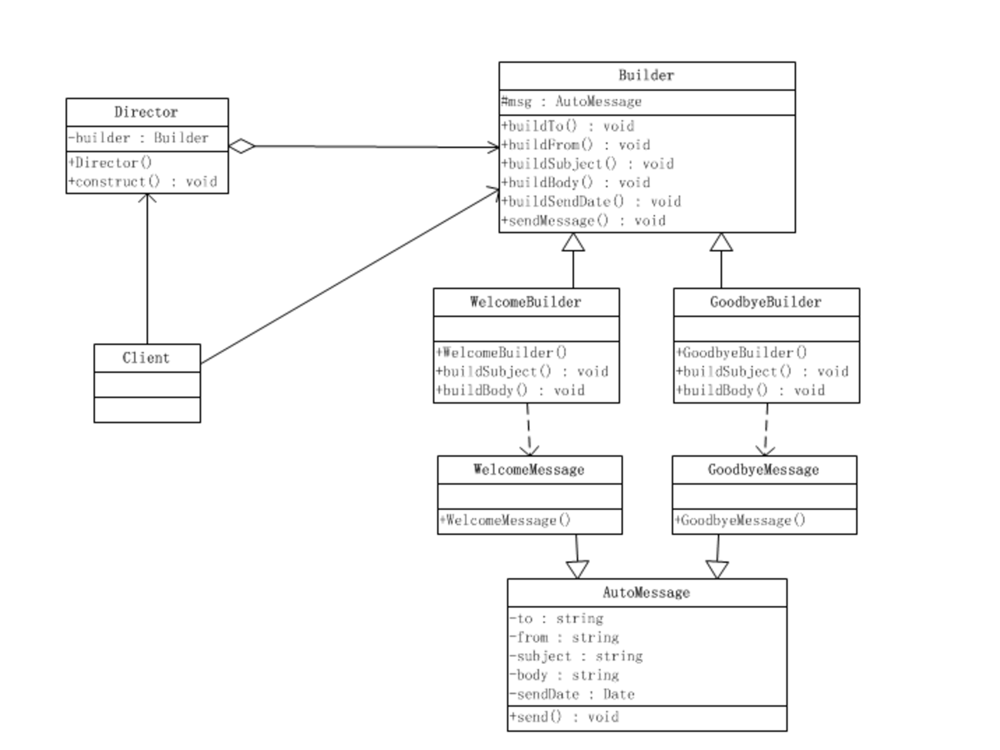
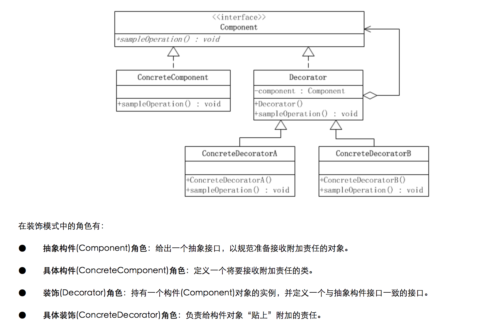
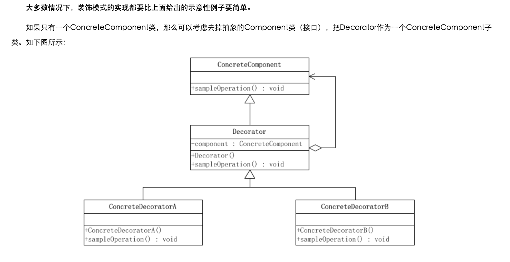
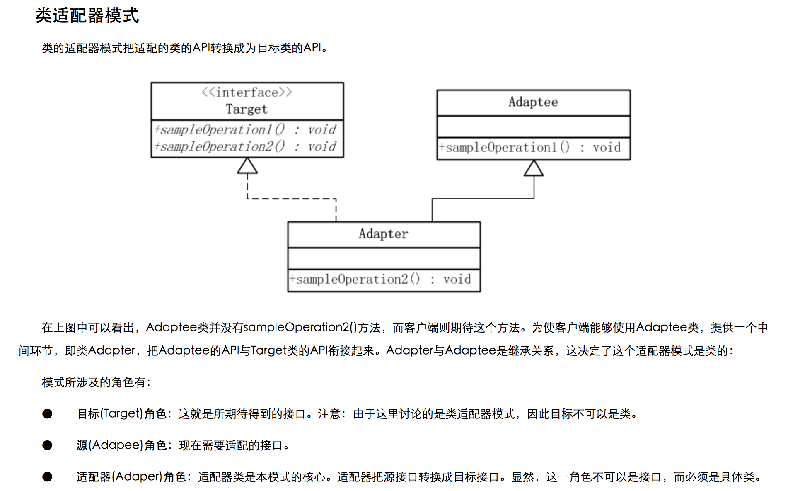
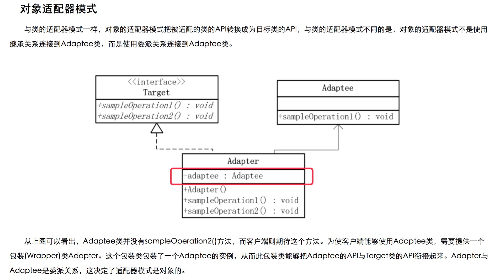
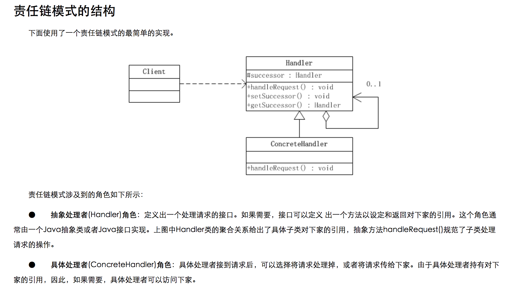
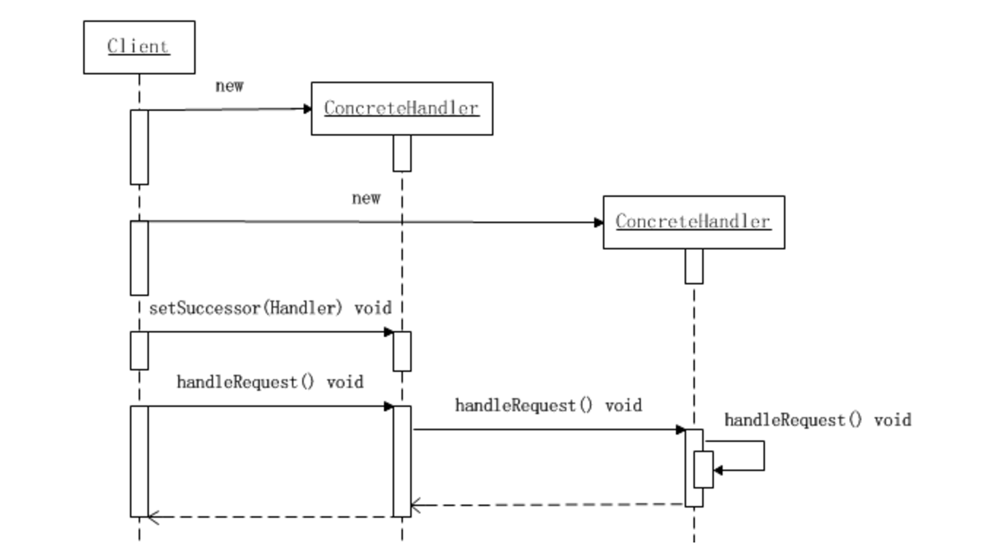

# 5分钟模仿设计模式
-------

## [观察者模式（Observer Pattern）](./readme/ObserverPattern.md)

-------

## 构造者模式（Builder Pattern）

	参考： http://www.cnblogs.com/java-my-life/archive/2012/04/07/2433939.html

### Demo1 集成构造者模式

	org.syl.inaction.pattern.BuilderPatternDemo1.java
	org.syl.inaction.pattern.builder.demo1.InsuranceContract.java

### Demo2 常规构造者模式

	org.syl.inaction.pattern.BuilderPatternDemo2.java
	org.syl.inaction.pattern.builder.demo2.*.java

### Demo3 常规构造者模式

	org.syl.inaction.pattern.builder.demo3.*.java

-------

## 装饰者模式（Decorator Pattern）

	装饰模式又名包装(Wrapper)模式。装饰模式以对客户端透明的方式扩展对象的功能，是继承关系的一个替代方案。

	参考：http://www.cnblogs.com/java-my-life/archive/2012/04/20/2455726.html#3584678

	典型UML：

	精炼UML：

### Demo1 装饰者模式

	org.syl.inaction.pattern.decorator.demo1

-------

## 适配器模式（Adapter Pattern）

	参考： http://www.cnblogs.com/java-my-life/archive/2012/04/13/2442795.html

	模式定义：适配器模式把一个类的接口变换成客户端所期待的另一种接口，从而使原本因接口不匹配而无法在一起工作的两个类能够在一起工作。

	类适配器模式 UML：

	对象适配器模式 UML：

### 类适配器 与 对象适配器 模式的比较

	类适配器使用对象继承的方式，是静态的定义方式；而对象适配器使用对象组合的方式，是动态组合的方式。

### 适配器模式的缺点(新功能的开发不使用适配器模式，老系统扩展升级才使用)

	过多的使用适配器，会让系统非常零乱，不易整体进行把握。比如，明明看到调用的是A接口，其实内部被适配成了B接口的实现，一个系统如果太多出现这种情况，无异于一场灾难。因此如果不是很有必要，可以不使用适配器，而是直接对系统进行重构。

### 我在什么场景下使用过适配器模式！？

	场景1:tools-maven-plugin中，将ERMaster模型适配为BizModel，自动生成dao代码；
	场景2:TIS项目版本轻量化改造中，TWS端增加

-------

## 责任链模式（Chain of Responsibility Pattern）

	参考：http://www.cnblogs.com/java-my-life/archive/2012/05/28/2516865.html

	定义：
	责任链模式是一种对象的行为模式。
	在责任链模式里，很多对象由每一个对象对其下家的引用而连接起来形成一条链。
	请求在这个链上传递，直到链上的某一个对象决定处理此请求。
	发出这个请求的客户端并不知道链上的哪一个对象最终处理这个请求，
	这使得系统可以在不影响客户端的情况下动态地重新组织和分配责任。

### Demo1

### 我在什么场景使用过责任链模式！？

	场景1:...

-------

## [XXXX模式](./readme/test.md)
