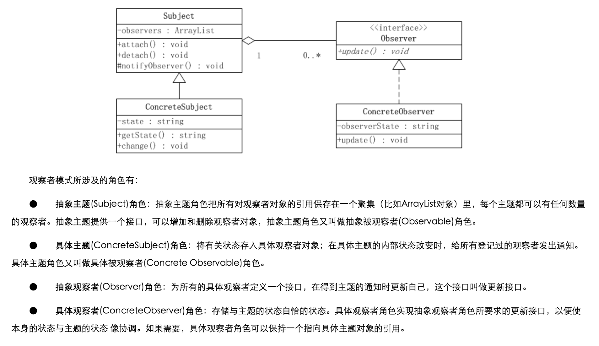

# 5分钟模仿设计模式
-------

## 观察者模式（Observer Pattern）

### Demo1 认识观察者模式结构
	
	
	
	org.syl.inaction.pattern.oberver.ObserverPatternDemo1.java
	org.syl.inaction.pattern.oberver.demo1.*.java
	
### Demo2 基于jdk接口的观察者模式
	
	org.syl.inaction.pattern.oberver.ObserverPatternDemo2.java
	org.syl.inaction.pattern.oberver.demo2.*.java
	
-------

## 构造者模式（Builder Pattern）

	参考： http://www.cnblogs.com/java-my-life/archive/2012/04/07/2433939.html

### Demo1 集成构造者模式

	org.syl.inaction.pattern.BuilderPatternDemo1.java
	org.syl.inaction.pattern.builder.demo1.InsuranceContract.java

### Demo2 常规构造者模式

	org.syl.inaction.pattern.BuilderPatternDemo2.java
	org.syl.inaction.pattern.builder.demo2.*.java

### Demo3 常规构造者模式

	

	org.syl.inaction.pattern.builder.demo3.*.java
