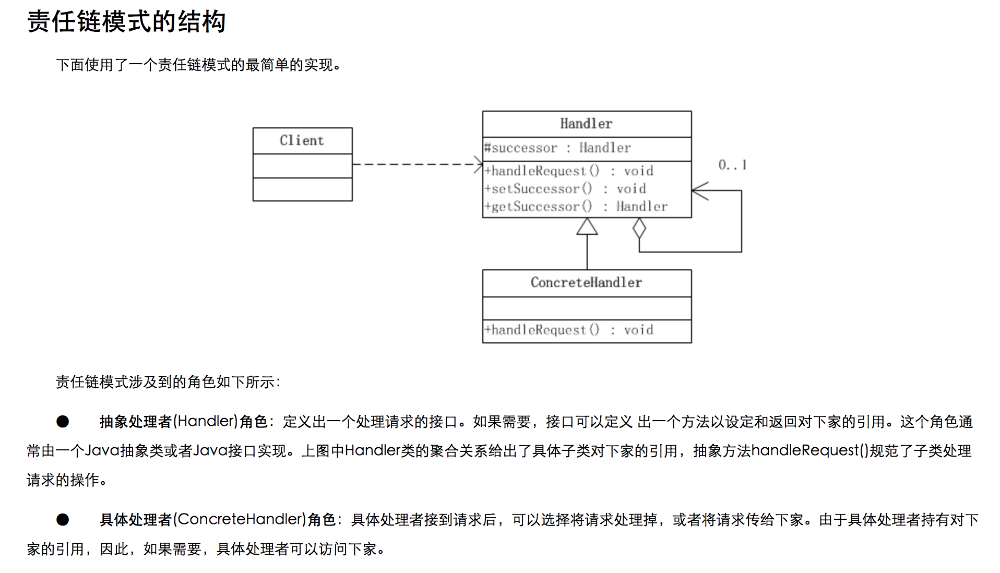

## 责任链模式（Chain of Responsibility Pattern）

	参考：http://www.cnblogs.com/java-my-life/archive/2012/05/28/2516865.html

	定义：
	责任链模式是一种对象的行为模式。
	在责任链模式里，很多对象由每一个对象对其下家的引用而连接起来形成一条链。
	请求在这个链上传递，直到链上的某一个对象决定处理此请求。
	发出这个请求的客户端并不知道链上的哪一个对象最终处理这个请求，
	这使得系统可以在不影响客户端的情况下动态地重新组织和分配责任。

### Demo1

### 我在什么场景使用过责任链模式！？

	场景1:...