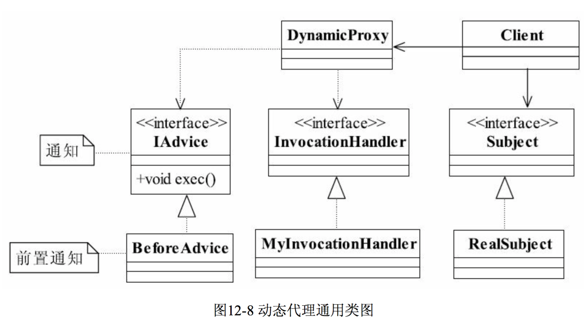
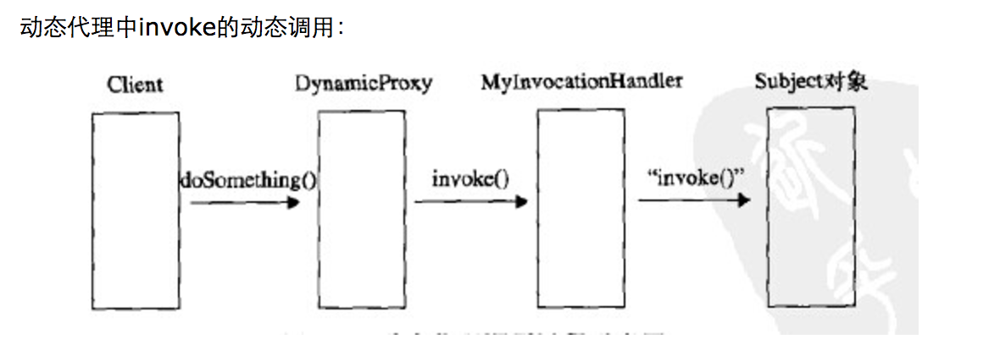

## 代理模式（Proxy Pattern）

	参考： 《设计模式之禅2版》

	模式定义：适配器模式把一个类的接口变换成客户端所期待的另一种接口，从而使原本因接口不匹配而无法在一起工作的两个类能够在一起工作。

	静态代理模式 UML：

### 动态代理模式

	动态代理模式 UML：

	
	参考： http://www.cnblogs.com/yemaozistar/p/4162032.html
	

	解释了代理的基本原理！
	参考： http://www.cnblogs.com/forlina/archive/2011/06/21/2085831.html

### Spring AOP 
	
	参考： 

	

