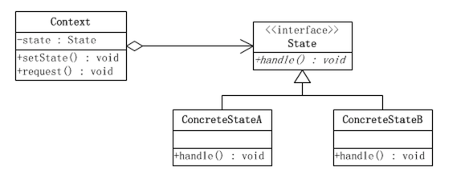

## 状态模式（State Pattern）

	参考： 《JAVA与模式》之状态模式

	模式定义：
		
		又称状态对象模式（Pattern of Objects for States），状态模式是对象的行为模式。
		
		状态模式允许一个对象在其内部状态改变的时候改变其行为。这个对象看上去就像是改变了它的类一样。

	状态模式所涉及到的角色有：
	环境(Context)角色，也成上下文：定义客户端所感兴趣的接口，并且保留一个具体状态类的实例。这个具体状态类的实例给出此环境对象的现有状态。
	抽象状态(State)角色：定义一个接口，用以封装环境（Context）对象的一个特定的状态所对应的行为。
	具体状态(ConcreteState)角色：每一个具体状态类都实现了环境（Context）的一个状态所对应的行为。

	参考资料： http://www.cnblogs.com/java-my-life/archive/2012/06/08/2538146.html

## 演示状态模式

	StatePatternDefinitionClient 演示状态模式的定义
	
	StatePatternVoteClient 演示投票控制场景：考虑一个在线投票系统的应用，要实现控制同一个用户只能投一票，如果一个用户反复投票，而且投票次数超过5次，则判定为恶意刷票，要取消该用户投票的资格，当然同时也要取消他所投的票；如果一个用户的投票次数超过8次，将进入黑名单，禁止再登录和使用系统。
	

## 认识状态模式

